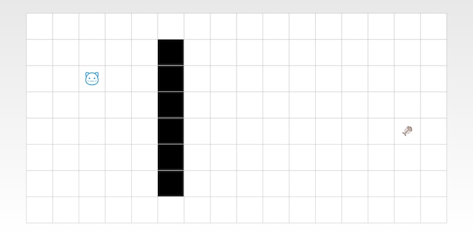
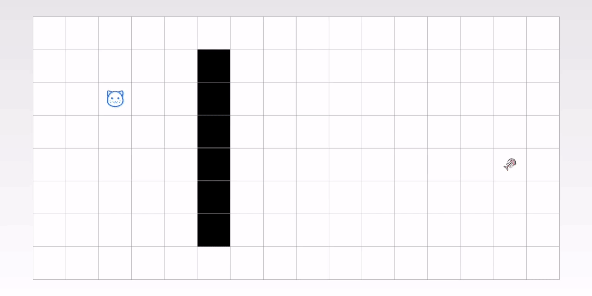
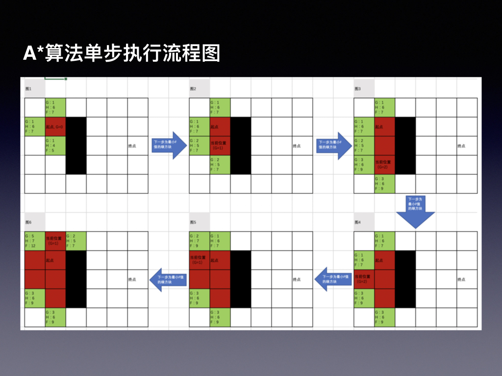
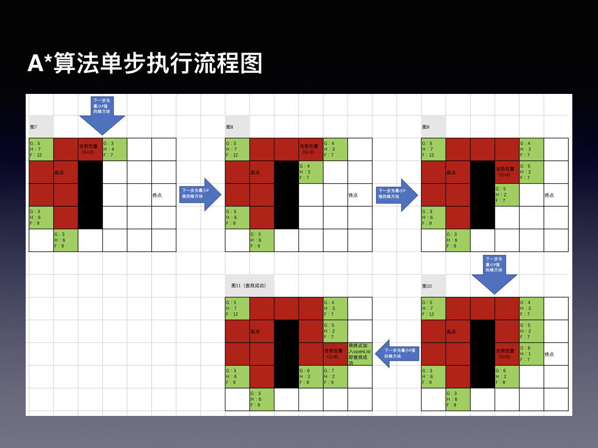

# A*寻路算法demo

该demo演示了A*寻路算法查找路径的过程

# 题目

如下图所示，猫需要吃到鱼骨头，图中黑色部分为墙，猫无法直接穿过墙，猫只能从某一点往上下左右四个方向行走，一次走一步，不能斜着走。要求出猫吃到鱼骨头的最短路径。



## 公式

F = G + H

* G: 表示从起点（猫）开始，到达某一个方块时需要走的步数
* H: 表示从某一个方块到终点（鱼骨头）要走的步数，本demo使用曼哈顿距离作为H值

## 算法涉及到的一些变量

* openList: 装载可能走的每一个方块

* closeList: 装载不可能再走的方块

* parent: 每个方块都有一个parent，记录上一步是从哪个方块走到当前方块的，通过parent还能回溯出查找到的路径

* 曼哈顿距离：听起来很牛批的名词，实际上是不考虑起点与终点中间的障碍物，直接将两点的横向与纵向距离相加得出的距离，用代码表示就是：

    ```
    distance = abs(start.x - end.x) + abs(start.y - end.y);
    ```

## 算法过程

A*算法的过程如下：

1. 将起点startStep放入openList中

2. 从openList中找最小F值的方块作为当前一步，记为curStep
    - 如果curStep就是终点，则结束执行，不继续后面的步骤，根据终点的parent可回溯出查找到的路径
    - 如果openList为空，则查找失败，不继续后面的步骤
    
3. 找curStep的上下左右四个方向的方块，记为around(n) 【around(n)的G值和H值都能在这时候计算出来】
    - 如果around(n)不在openList中，则将其加入openList
    - 如果around(n)在openList中，则需要重新计算around(n)的G值，如果G值比它之前计算出的G值更小，则需要更新around(n)的G,H值，并更新around(n)的parent

4. 重复执行第2步直到查找结束

# Demo运行结果



# Demo Apk下载


# A*算法单步执行过程示意图


