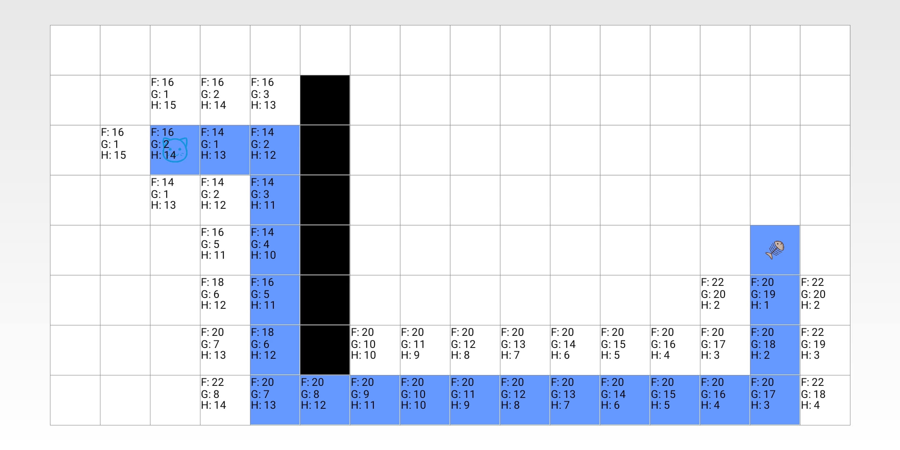

# A*寻路算法demo

该demo演示了A*寻路算法查找路径的过程

# 题目

如下图所示，猫需要吃到鱼骨头，图中黑色部分为墙，猫无法直接穿过墙，猫只能从某一点往上下左右四个方向行走，一次走一步，不能斜着走。要求出猫吃到鱼骨头的最短路径。

## 公式

F = G + H

* G: 表示从起点（猫）开始，到达某一个方块时需要走的步数
* H: 表示从某一个方块到终点（鱼骨头）要走的步数

## 算法过程

A*算法的过程如下：

1. 计算当前位置的四个方向每一步的F值
2. 取其中最小的F值作为下一步行走
3. 在下一步重复计算当前位置四个方向的每一步的F值

其中第2步中可能在多个方向上都存在最小F值，此时应该递归处理，获取多条路径后取其中最短的路径。

# Demo运行结果

